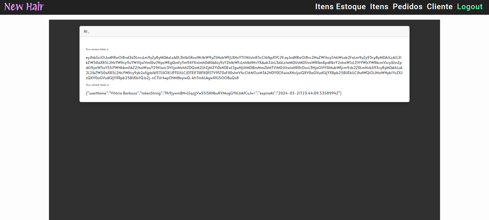

# Bem-vindo ao Projeto Empresa!

Eu sou Daniel, o desenvolvedor responsável por este projeto. Este é um empreendimento destinado a fornecer uma infraestrutura sólida para projetos subsequentes, visando otimizar o processo de busca e configuração de bibliotecas. É evidente que o sistema apresenta uma complexidade estrutural que supera a de simples regras de negócio. Conforme mencionado anteriormente, a intenção é incorporar o maior número possível de requisitos não funcionais, de modo a torná-lo útil para sistemas futuros, além de servir como um portfólio de melhores práticas.

Aqui poderá ser encontrada todas as regras de negócio solicitada ao longo de minha carreia.

## Requisitos de Máquina

Ter a versão mais atual do Docker intalada.
Ter configurado o ambiente de desenvolvimento para .NET 8, possuir a versão 20.11.0 NodeJS e ter o gerenciador de pacotes Yarn instalados.

## Instalação

Após baixar o repositório localmente será necessário importar a solução que estará na pasta webapi para que sejam baixadas suas dependências,

Quanto ao projeto angular, é necessário rodar 2 linhas de comando: `yarn` e `yarn dev`.

Obs: A primeiro momento, não é possivel inciar o projeto localmente, devido as configurações do banco de dados estarem contidas todas no docker. Decisão tomada para ter um start rapido da aplicação.

## Utilização

Rodando o comando, `docker-compose up --build --remove-orphans -d`, teremos o aplicativo já implantado e acessível no [Aplicação Angular](http://localhost:8080/login). O que pode demorar de acordo com a capacidade da sua máquina de processar todas as imagem de docker e posteriormente publica-las.
A documentação da API ficará em [Empresa API](http://localhost:5001/index.html)

Para fazer login é nescessário a baixar [API de authenticação](https://github.com/NielDevSft/JWTAuthentication) e configurar um usuário. A Role da API deste projeto é `CLIENTE_ADM_EMPRESA`.

O sistema persiste em desenvolvimento, mas a estrutura sólida onde ele é contruida, a fim de demonstrar habilidade de escritura complexa de código do que apenas avaliando o negócio que, provavelemte poderia ser comportado em um contexto mais simples.

## Autor

[Daniel da silva Figueiredo](https://github.com/NielDevSft) - Desenvolvedor FullCycle.

## Aplicação que faz uso desta API

[Aplicação em anuglar](https://github.com/NielDevSft/empresa)

## Projeto Angular

Foi utilizado [Angular Material](https://material.angular.io) e [NgRx](https://ngrx.io) neste projeto, pois essas tecnologias oferecem diversas vantagens que contribuem significativamente para o desenvolvimento e aprimoramento da experiência do usuário.

### Vantagens de Utilizar Angular Material

[Angular Material](https://material.angular.io) é uma biblioteca de componentes UI para Angular, baseada no Material Design do Google. Algumas das vantagens que motivam sua utilização incluem:

- **Ampla Variedade de Componentes:** Angular Material oferece uma ampla gama de componentes prontos para uso, como botões, campos de entrada, barras de progresso, entre outros. Isso acelera o processo de desenvolvimento, pois os desenvolvedores podem aproveitar componentes consistentes e bem projetados em seus aplicativos.

- **Design Responsivo e Acessível:** Os componentes do Angular Material são construídos com foco na responsividade e acessibilidade, garantindo uma experiência de usuário consistente em dispositivos de diferentes tamanhos e para pessoas com diferentes habilidades e necessidades.

- **Tema Personalizável:** A biblioteca permite a personalização do tema para alinhar a aparência do aplicativo com a identidade visual desejada. Os desenvolvedores podem facilmente ajustar cores, tipografia e outros aspectos visuais para criar uma experiência de usuário única e coesa.

- **Integração com Angular:** Angular Material é uma escolha natural para projetos Angular, pois é desenvolvida e mantida pela equipe por trás do Angular. Isso garante uma integração suave e compatibilidade com as últimas versões do Angular, facilitando o desenvolvimento e a manutenção de aplicativos Angular.

- **Suporte da Comunidade:** Angular Material possui uma comunidade ativa, proporcionando suporte contínuo, atualizações frequentes e uma ampla variedade de recursos adicionais, como temas personalizados, plugins e extensões. Isso permite que os desenvolvedores aproveitem o conhecimento coletivo da comunidade para resolver problemas e melhorar seus aplicativos.

### Vantagens de Utilizar Angular Redux

[Angular Redux](https://ngrx.io) é uma biblioteca para gerenciamento de estado inspirada no Redux, desenvolvida especificamente para aplicações Angular. Aqui estão algumas razões para escolher Angular Redux:

- **Padrão de Gerenciamento de Estado Previsível:** Angular Redux implementa o padrão de gerenciamento de estado unidirecional, proporcionando uma forma previsível de controlar o estado da aplicação.

- **Imutabilidade de Estado:** Ao adotar o conceito de imutabilidade de estado, Angular Redux facilita a detecção de mudanças e a depuração do estado da aplicação.

- **Devtools Integrados:** Assim como o Redux original, Angular Redux oferece ferramentas de desenvolvimento que facilitam a visualização e depuração do estado da aplicação.

- **Efeito de Lado Integrado:** O Angular Redux inclui suporte para efeitos de lado, permitindo a execução de operações assíncronas de forma controlada e reativa.

Foi utilizado [Angular Material](https://material.angular.io) e [Angular Redux](https://ngrx.io) neste projeto para aproveitar essas vantagens e proporcionar aos usuários uma experiência consistente, eficiente e visualmente atraente.

## Projeto .NET 8

Foi utilizado [.NET 8](https://dotnet.microsoft.com/download/dotnet/8.0) neste projeto, pois essa tecnologia oferece diversas vantagens que contribuem significativamente para o desenvolvimento e eficiência da aplicação.

### Vantagens de Utilizar C# 10

[C# 10](https://docs.microsoft.com/en-us/dotnet/csharp/) é a mais recente versão da linguagem de programação C#, oferecendo melhorias substanciais e recursos modernos. Algumas das vantagens que motivaram sua escolha incluem:

- **Recursos da Linguagem:** C# 10 introduz aprimoramentos significativos na linguagem, proporcionando uma sintaxe mais concisa e expressiva.

- **Melhorias de Desempenho:** Atualizações de desempenho contínuas garantem que a aplicação seja executada de maneira mais eficiente e responsiva.

- **Recursos de Segurança Aprimorados:** C# 10 traz melhorias de segurança importantes, garantindo que a aplicação seja robusta contra ameaças.

- **Suporte à Programação Funcional:** Recursos modernos como expressões lambda e LINQ tornam a programação em C# mais concisa e elegante.

### Vantagens de Utilizar .NET 8

[.NET 8](https://dotnet.microsoft.com/download/dotnet/8.0) é a mais recente versão do framework .NET, oferecendo uma variedade de recursos poderosos para o desenvolvimento de aplicativos. Algumas das razões para escolher .NET 8 incluem:

- **Cross-platform:** .NET 8 oferece suporte para desenvolvimento em diversas plataformas, incluindo Windows, Linux e macOS.

- **Desenvolvimento de Aplicativos Web e Desktop:** Com .NET 8, é possível desenvolver aplicativos web modernos usando ASP.NET Core e aplicativos desktop usando o framework .NET MAUI.

- **Ecosistema Unificado:** .NET 8 unifica os ecossistemas .NET Core e .NET Framework, oferecendo uma experiência de desenvolvimento consistente e simplificada.

- **Alto Desempenho:** .NET 8 traz melhorias significativas de desempenho, resultando em aplicativos mais rápidos e responsivos.

### Vantagens de Utilizar JWT (JSON Web Token)

[JWT (JSON Web Token)](https://jwt.io/) é um método compacto, seguro e autocontido para transmitir informações entre partes como um objeto JSON. Algumas das vantagens de utilizar JWT incluem:

- **Segurança:** JWT pode ser assinado digitalmente para garantir integridade e autenticidade dos dados, proporcionando um meio seguro de comunicação entre cliente e servidor.

- **Escalabilidade:** Por ser autônomo, o token JWT pode ser facilmente distribuído e validado em diferentes serviços e microsserviços, facilitando a construção de arquiteturas escaláveis.

- **Desempenho:** Como o token JWT é autocontido, não há necessidade de consultas adicionais ao banco de dados para verificar sua validade, o que melhora o desempenho da aplicação.

Foi utilizado [C# 10](https://docs.microsoft.com/en-us/dotnet/csharp/), [.NET 8](https://dotnet.microsoft.com/download/dotnet/8.0) e [JWT](https://jwt.io/) neste projeto para aproveitar essas vantagens e proporcionar aos desenvolvedores um ambiente de desenvolvimento moderno, seguro e eficiente.

## Todo feedback é bem-vindo

[LinkedIn - Daniel Figueiredo](https://www.linkedin.com/in/daniel-figueiredo-developer/)
